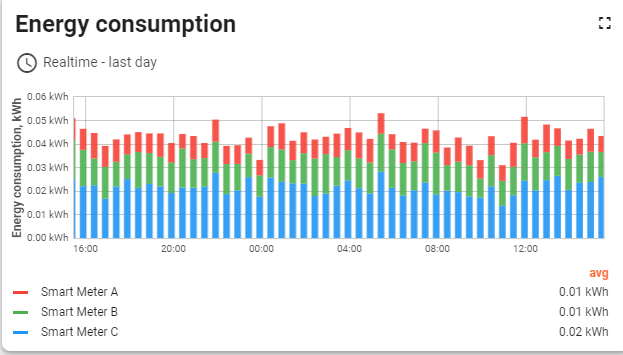
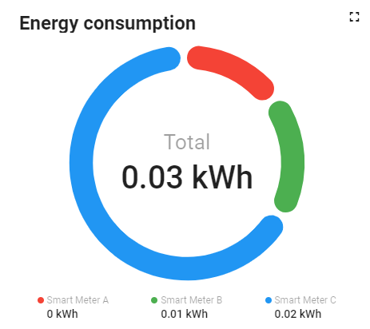
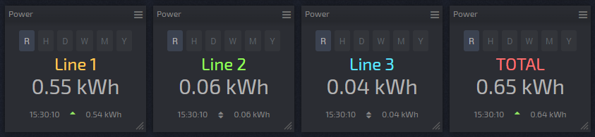
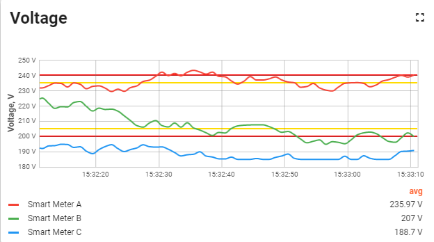
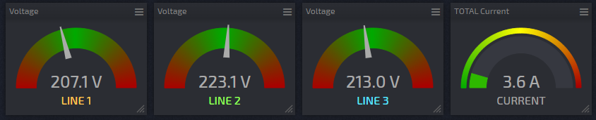
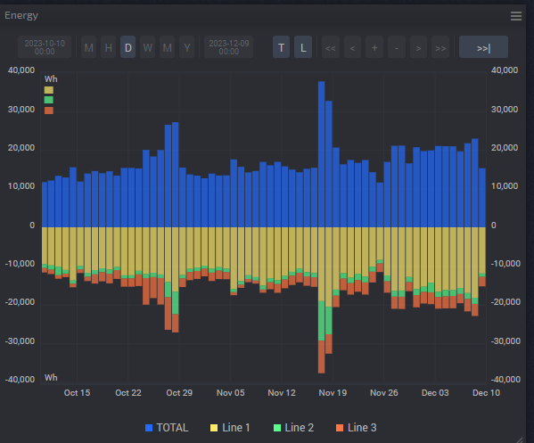
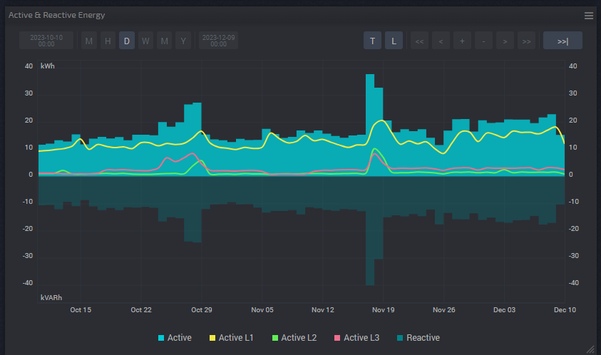

# Energy Consumption Monitoring System

## Features

1. **Energy Consumption (KWH) - Power**

   - **representation**: Numerical  
   - Line charts for Line 1, Line 2, Line 3, and Total KWH.

   

   

    
2. **Voltage**

   - **representation**: Gauge chart  
   - Line 1, Line 2, Line 3, and Total Voltage (current).

    

    

3. **WH (Watt-Hours) - Energy**

   - **representation**: Bar graph
   - overlap for Line 1, Line 2, Line 3, and Total WH.

   

4. **Active Energy and Reactive Energy**

   - **Active Energy (KWH):**
     - **representation**: Line graph
     - Line 1, Line 2, Line 3, and Total Active Energy.

   - **Reactive Energy (Kvarh):**
     - **representation**: Line graph
     - Line 1, Line 2, Line 3, and Total Reactive Energy.

